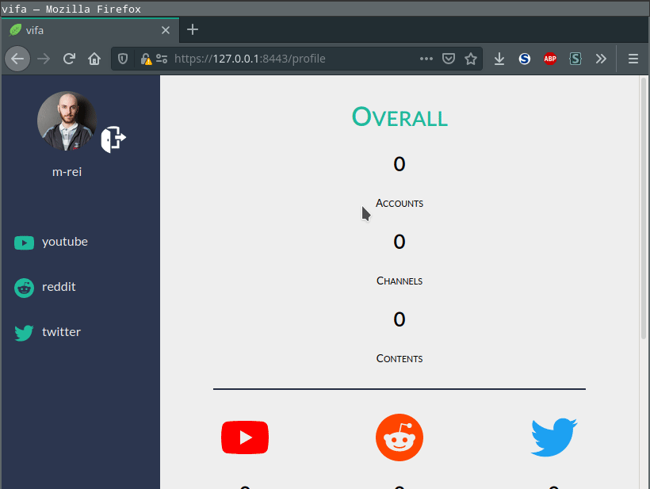
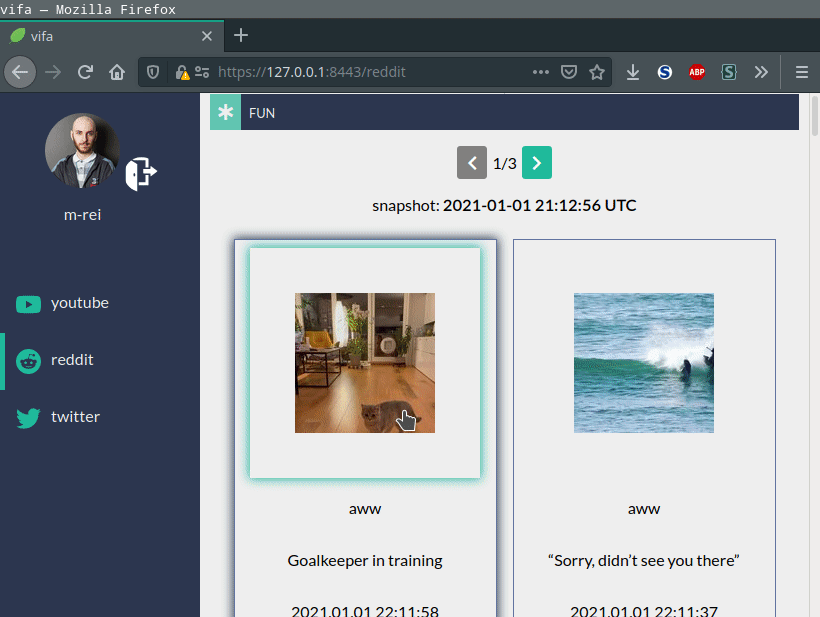

# **vifa** - **vi**sual **f**eed **a**ggregator

automatically aggregate media content from multiple social media platforms in one place!

this little webapp periodically pulls feeds of people you follow and lets you preview & visit their content.

## what it looks like

after the background task has updated the channels

responsiveness

## run

set up these two env parameters in the  [docker-compose.yml](docker-compose.yml) file

    GOOGLE_OAUTH2_CLIENT_ID
    GOOGLE_OAUTH2_CLIENT_SECRET
    
 and then run

    docker-compose up

in the root folder and visit https://127.0.0.1:8443

you can generate them in the [google dev console](https://console.developers.google.com/apis/credentials)!  
make sure you add the following URI to the "Authorized redirect URIs":

    https://127.0.0.1:8443/login/oauth2/callback

if you want your local changes to be reflected in docker-compose, you have to run

    docker-compose build

since its a local setup, visiting the page from your mobile phone won't work because of google oauth2 redirecting back to 127.0.0.1 (the same machine where the server is running, not your mobile phone)!  
non-local setup requires the use of a domain in the redirect URIs setting in the google dev console!

optionally, you can change the mounting volume inside the compose files.  
the default is

    ~/mysql/vifa/

---

if you are using vscode, don't forget to also set the same env parameters in the [launch.json](.vscode/launch.json) file!

debugging in vscode does not require a `docker-compose build` with the current setup!

## details

login works exclusively via google oauth2

as of now, 3 social media sites are supported - youtube, reddit and twitter!

you can create sub-accounts for each social media kind and add channels to them.

a channel is the landing- or profile page for a specific social media kind. the input field's tooltip will show you examples of what you can input!

channels are unique for all users of vifa. each channel's content gets periodically updated in one of the background tasks and the user of vifa always gets a snapshot view of the last update. since the channels are unique, each channel gets updated once, even if multiple users share it! removing a channel does not remove it entirely, as other accounts may still be following it.

channel content older than a week gets removed, so you only have access to the latest content!

this app is a more general purpose version of my [similar project](https://github.com/m-rei/youtube-feeds)!
